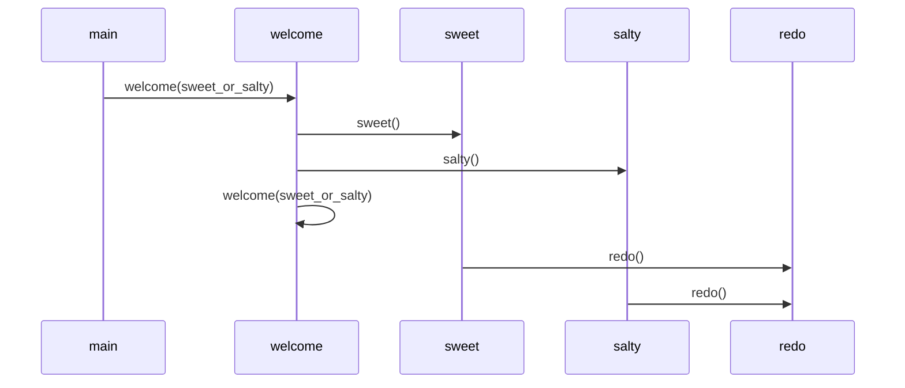

```mermaid
sequenceDiagram
  participant main
  participant welcome
  participant sweet
  participant salty
  participant redo
  main->>welcome: welcome(sweet_or_salty)
  welcome->>sweet: sweet()
  welcome->>salty: salty()
  welcome->>welcome: welcome(sweet_or_salty)
  sweet->>redo: redo()
  salty->>redo: redo()
```
