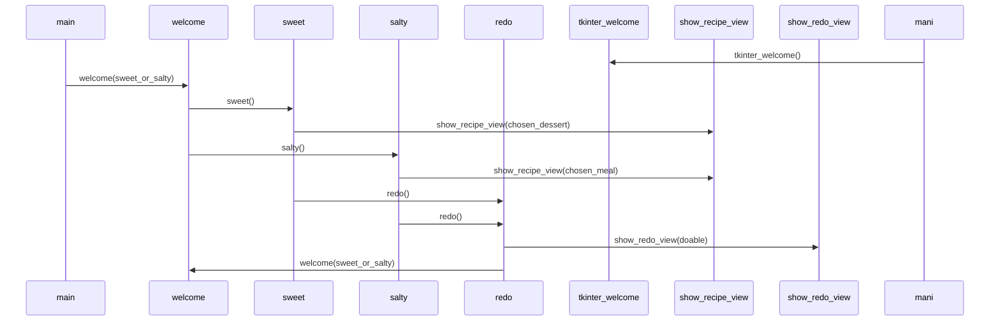

```mermaid
sequenceDiagram
  participant main
  participant welcome
  participant sweet
  participant salty
  participant redo
  participant tkinter_welcome
  participant show_recipe_view
  participant show_redo_view
  mani->>tkinter_welcome: tkinter_welcome()
  main->>welcome: welcome(sweet_or_salty)
  welcome->>sweet: sweet()
  sweet->>show_recipe_view: show_recipe_view(chosen_dessert)
  welcome->>salty: salty()
  salty->>show_recipe_view: show_recipe_view(chosen_meal)
  sweet->>redo: redo()
  salty->>redo: redo()
  redo->>show_redo_view: show_redo_view(doable)
  redo->>welcome: welcome(sweet_or_salty)
```
