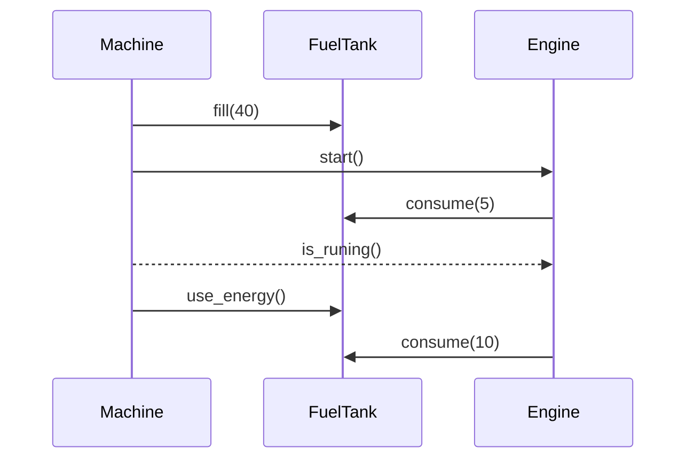

```mermaid
sequenceDiagram
  participant Machine
  participant FuelTank
  participant Engine
  Machine->>FuelTank: fill(40)
  Machine->>Engine: start()
  Engine->>FuelTank: consume(5)
  Machine-->>Engine: is_runing()
  Machine->>FuelTank: use_energy()
  Engine->>FuelTank: consume(10)
```
